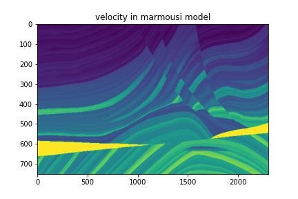

# Geophysical Data
- The repo contain several kinds of undergroud physical paramters model, such as Marmousi 
- You can access more geophysical data on [SEG open data](https://wiki.seg.org/wiki/Open_data) website
- [Segyio](https://github.com/equinor/segyio#:~:text=Segyio%20is%20a%20small%20LGPL,oriented%20library%20for%20seismic%20applications.) is a library for easy interaction with SEG-Y and Seismic Unix formatted seismic data, with language bindings for Python and Matlab, [here](./read_data.ipynb) is an example to read data from `.segy` file  